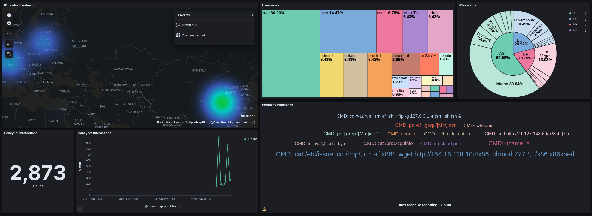

# Awesome-Honeypot
Cowrie Honeypot with Elasticsearch



# Honeypot Installation

## Prerequisites
- Linux machine with at least 3CPU and 2 GB RAM. In case of less than 8gb RAM, make sure to use Swap Memory
- Docker and docker-compose installed
- Suitable firewall and security configuration

## SSH Configuration

The honeypot will use port 22, so we need to change the port of the actual ssh service.
```bash
sudo nano /etc/ssh/sshd_config
```
Edit the sshd config file and set the ssh port
```text
Port 2200
```
Resart the ssh service. You can access your machine via ssh on port 2200
```bash
systemctl restart sshd
```

## Honeypot setup
Install the Honeypot and elasticsearch for monitoring using dompose-compose
- **Cowrie**: SSH/Telnet Honeypot
- **Elasticsearch**: Database containing all logs
- **Logstash/Filebeat**: Pipeline for indexing the honeypot logs
- **Kibana**: UI to analyze the data and build dashboards

### Download required files
Clone the repo containing the docker and elasticsearch configurations. For GeoIP locations the GeoIP data from www.maxmind.com (free but requires registration) is required: download the GeoLite2 City GZIP. Unzip it and locate the ``GeoLite2-City.mmdb`` file in the repo folder next to the docker-compose file.
```bash
git clone https://github.com/code-byter/Awesome-Honeypot.git
cd Awesome-Honeypot
```

### Launch Containers
Next, the docker containers can be launched. This might take a while until all are fully operational-
```bash
sudo docker-compose up -d
```

You can verify if the elasticsearch database is operational by the folowing curl command. You might have to wait some minutes until the command works.
```text
root@ubuntu-s-2vcpu-2gb-fra1-01:~/Honeypot# curl localhost:9200
{
  "name" : "8e7w7ed73ae1",
  "cluster_name" : "docker-cluster",
  "cluster_uuid" : "GDdYud31343242SxXA",
  "version" : {
    "number" : "7.14.1",
    "build_flavor" : "default",
    "build_type" : "docker",
    "build_hash" : "66b55ebfa59c92c15db3f69a335d500018b3331e",
    "build_date" : "2021-08-26T09:01:05.390870785Z",
    "build_snapshot" : false,
    "lucene_version" : "8.9.0",
    "minimum_wire_compatibility_version" : "6.8.0",
    "minimum_index_compatibility_version" : "6.0.0-beta1"
  },
  "tagline" : "You Know, for Search"
}
```
### Configure the dashboard
Once your elasticsearch database is operational, you can import the dashboard configuration.  
```bash
bash setup_index.sh
```

## Acesss

The data can be accessed through the Kibana web interface on port ``5601``
- [Discover](http://localhost:5601/app/discover) lists the individual logs. It's useful to get an overview of the data and query it.
- [Dashboards](http://localhost:5601/app/dashboards) shows the created dashboards. One of them is the previously imported one for your cowrie honeypot.  
